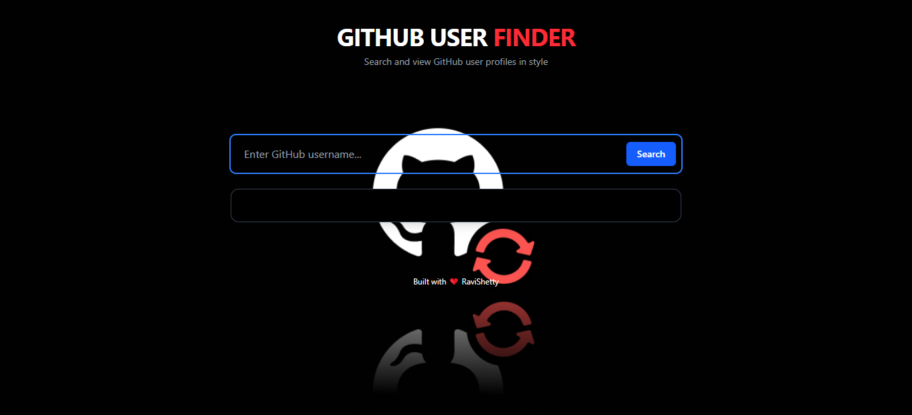

# 🔍 GitHub User Finder

A sleek and responsive web application to search for GitHub users and view their profile details in real-time. Built using **HTML**, **CSS**, **JavaScript**, and **Tailwind CSS**.

 <!-- Replace with your actual screenshot path -->

---

## 🚀 Features

- 🔎 Search any GitHub user by username
- 📄 Displays user's profile: name, bio, avatar, followers, following, company, location, public repos, and blog
- ⚡ Responsive and modern UI with Tailwind CSS
- ⌨️ Press `Enter` or click the search button to fetch user data
- ❌ Error handling for non-existent users

---

## 🛠️ Tech Stack

- **HTML5**
- **CSS3**
- **Tailwind CSS**
- **JavaScript**
- **GitHub API**

---

## 📸 Preview

<!-- Add live site link or gif preview here if available -->
[Live Demo](https://githubuserfinder-project.netlify.app/) <!-- Replace with actual live link -->

---

## 🧑‍💻 How It Works

1. User enters a GitHub username.
2. On clicking the **Search** button or pressing **Enter**, a request is sent to the GitHub API.
3. If the user exists, the profile information is displayed in a styled card.
4. If the user doesn't exist, a friendly alert is shown.

---

## 📫 Contact

Created with ❤️ by **Ravi Shetty**  
📧 Email: [ravishetty05082@gmail.com](mailto:ravishetty05082@gmail.com)  
💼 LinkedIn: [Ravi Shetty](https://www.linkedin.com/in/ravi-m-shetty/)